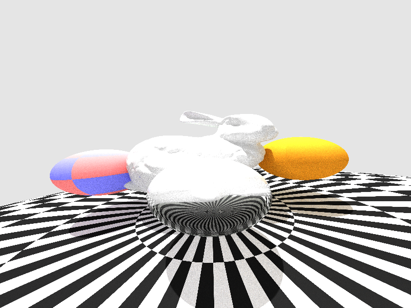
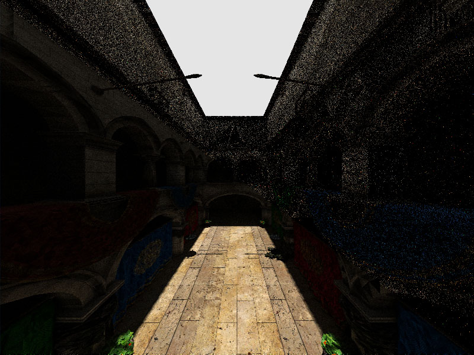

# Prim

## Description

This is a CPU based ray-tracing renderer using multi-threading capacity of CPU for faster rendering. It is not designed for performances as it is a pet project. Its goal is to reimplement diverse features related to ray-tracing and more generally rendering in order to better understand them. It is designed to be easy to understand and read, but also scalable (to test many shapes, materials, lights...). That's why I am using object oriented design for easier clarity, while still using some data oriented design when required.

The BVH implementation is totally custom and based on kd tree algorithm. It could be faster using Embree or such API.

The path tracing implementation is simple and uses next event estimation to provide faster lighting.

Some spheres and Stanford bunny rendered within Prim.

Sponza with 80 samples compared to 1 sample

## Features
- [x] Load and display OBJ with MTL
- [x] Whitted & path tracer implementation
- [x] Custom BVH mesh intersection
- [x] Scalable materials
- [x] Manage color correction & sRGB
- [ ] Improve path tracing implementation
- [ ] Load and display glTF
- [ ] Depth of field
- [ ] Mipmaping & anisotropy
- [ ] Embree or such BVH intersection
- [ ] Better light sampling to handle multiple light sources
- [ ] Atmosphere simulation
- [ ] [...]
