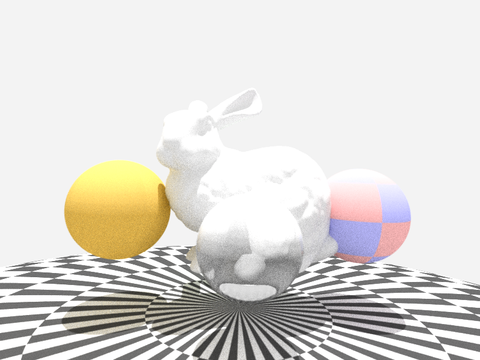

# Prim

## Description

This is a CPU based ray-tracing renderer using multi-threading capacity of CPU for faster rendering. It is not designed for performances as it's a didactic pet project. Its goal is to reimplement diverse features related to ray-tracing and more generally rendering in order to better understand them. It is designed to be easy to understand and read, but also scalable (to test many shapes, materials, lights...).

The BVH implementation is totally custom and non optimized, based on a kmean clustering. It could be faster using Embree or such API.

The path tracing implementation is simple and uses next event estimation to provide faster lighting.

Some spheres and Stanford bunny rendered within Prim.

Sponza with 20 samples

## Features
- Perspective & ortho camera
- Whitted & Path tracing implementation
- Cusom BVH & Octree
- Scalable materials
- Depth of field

## Roadmap
- Optimize BVH or use Embree
- Improve path tracing implementation
- Load and display glTF (Or use ASSIMP)
- Mipmaping & anisotropy
- Better light sampling (handle multiple light sources)
- Atmosphere simulation
- [...]
